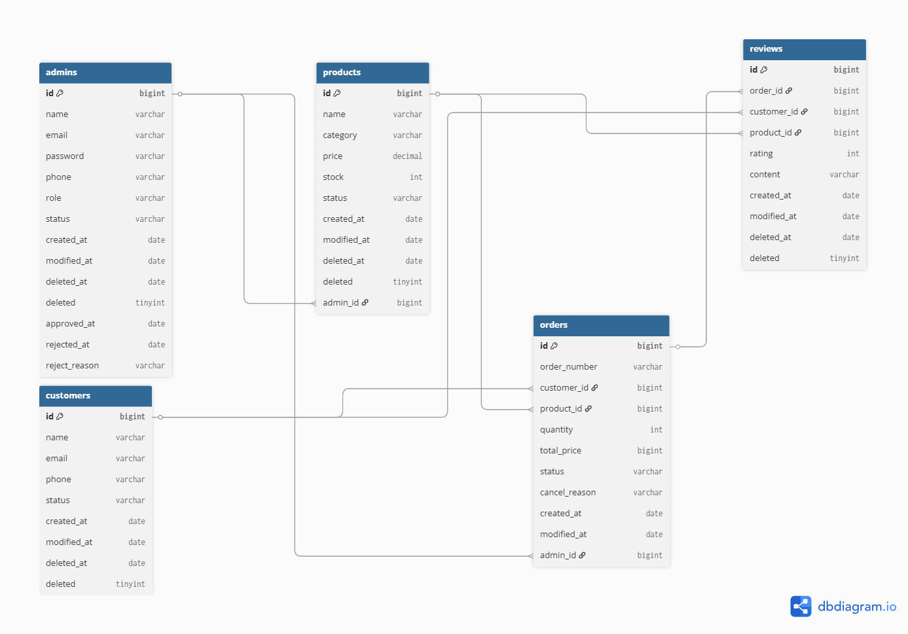

<h1 align="center">🛒 E-Commerce Backoffice</h1>

<p align="center">
  관리자용 이커머스 백엔드 서비스<br>
</p>

---

<!-- ===================== -->
<!-- 🏷 기술 뱃지 -->
<!-- ===================== -->

<p align="center">


</p>

---

## 📌 프로젝트 소개

이 프로젝트는 **이커머스 관리자 시스템(Backoffice)** 으로  
주문, 상품, 관리자, 고객, 리뷰 데이터를 관리하고  
**대시보드를 통해 비즈니스 지표를 빠르게 확인**할 수 있도록 만든 백엔드 서비스입니다.

요구사항
- 고객, 상품, 주문 정보를 **체계적으로 관리**할 수 있는 기능 필요
- 상품 리뷰를 **조회하고 관리**할 수 있으며, **상품별 평점과 통계**를 제공하는 기능 필요
- 관리자가 백오피스에 **회원가입을 요청**하고, 슈퍼 관리자가 **승인/거부**할 수 있는 기능 필요
- 관리자 계정의 **역할 기반 액세스 제어(RBAC)** 필요
- 데이터 증가에 따른 **검색, 정렬, 필터, 페이징** 기능 필요
- 커머스 서비스 현황을 한눈에 파악할 수 있는 **대시보드** 기능 필요

---

## 👥 팀소개

| 이름  | 역할               | 담당                                                        |
|-----|------------------|-----------------------------------------------------------|
| 최길중 | 리더 / 관리자 / 발표 담당 | 발표자료 제작, 발표 리허설 주도        |
| 박영수 | 인증,인가 / 관리자 | 관리자 (회원가입, 인증, 정보관리)       |
| 박소영 | 고객 | 고객(회원가입, 로그인,리스트 조회, 상세 조회, 정보 수정, 상태 변경, 삭제)     |
| 김소현 | 주문 / 대시보드 / 기록 담당 | 회의록 정리 / Readme 수합 및 관리 / 주문 상태 업데이트, 대시보드 구현        |
| 홍성현 | 주문 / 발표 담당 | 발표자료 제작, 발표 리허설 주도            |
| 소수경 | 상품 / 리뷰 | 상품(등록, 리스트/상세 조회, 수정, 재고변경, 상태변경, 삭제) / 리뷰(리스트/상세 조회, 삭제) |

<br>

### [📎프로젝트 노션 바로가기](https://www.notion.so/teamsparta/2-2ff2dc3ef514805aa074fd80c0ad353d)

<br>

---

## 🚀 주요 기능

### Admin
- 관리자 상태 관리
- Soft Delete 탈퇴 처리

### Customer
- 고객 상태 관리
- Soft Delete 탈퇴 처리

### Dashboard
- 관리자 / 고객 / 상품 / 주문 / 리뷰 카운트
- 총 매출 / 상태별 주문 수 집계
- 리뷰 평점 분포 차트
- 고객 상태 분포
- 카테고리 분포
- 최근 주문 목록 조회

### Order
- 주문 생성
- 주문 목록 / 상세 조회
- 주문 상태 변경
- 주문 취소

### Product
- 상품 등록 / 수정 / 삭제
- 재고 관리

### Review
- 평점 분포 통계
- 상품 리뷰 조회

---

## ⏲️ 개발기간
- 2026.02.19(목) ~ 2026.02.26(목)

---

## 🧠 적용 기술

- BaseEntity
- JPA / JPQL
- MySQL
- Validation
- 페이징 조회
- Spring Security
- QueryDSL
- JWT
- Soft Delete
- 공통 응답 DTO
- Builder + record
- 전역 예외 처리 (CommonError, CommenException, GlobalExceptionHandler)

---

## 🖥 Development Environment

| 항목 | 버전 |
|---|---|
| Java | 17 |
| Spring Boot | 3.x |
| Gradle | 8.x |
| MySQL | 8.x |
| JPA | Hibernate |
| IDE | IntelliJ |

---

## 🧩 Architecture

<p align="center">
  
</p>

---

## 🖼 API 명세서

<p align="center">
  
</p>

---

## 🗄 ERD Diagram

<p align="center">
  
</p>

---

## 🔧 Technologies & Tools (BE)

 
 
 


  

  

 


---

## 📈 프로젝트 파일 구조

```text
src/main/java/com/commerce/manageit/
├── domain/                    # 핵심 비즈니스 로직 (도메인별 분리)
│   ├── customer/              # 고객(Customer) 관련 도메인
│   │   ├── controller/        # API 엔드포인트
│   │   ├── service/           # 비즈니스 로직
│   │   ├── repository/        # DB 접근 계층
│   │   ├── entity/            # JPA 엔티티 (Domain Model)
│   │   └── dto/               # Request / Response 객체
│   └── product/               # 상품(Product) 관련 도메인
│       ├── controller/
│       ├── service/
│       ├── repository/
│       ├── entity/
│       └── dto/
├── global/                    # 프로젝트 전역 공통 설정
│   ├── config/                # Framework 설정 (Security, Swagger, JPA 등)
│   ├── error/                 # 예외 처리 (ExceptionHandler, ErrorCode)
│   ├── common/                # 공통 추상 클래스 (BaseEntity, ApiResponse)
│   └── util/                  # 유틸리티 및 확장 함수 (Extension, Utils)
└── ManageItApplication.java   # 프로젝트 메인 실행 클래스
```

---

## 🚨 Trouble Shooting

👉 **[Dashboard Query Optimization - 인덱스 설계를 통한 대시보드 성능 개선](docs/TroubleShooting/TroubleShooting1.md)**

---

